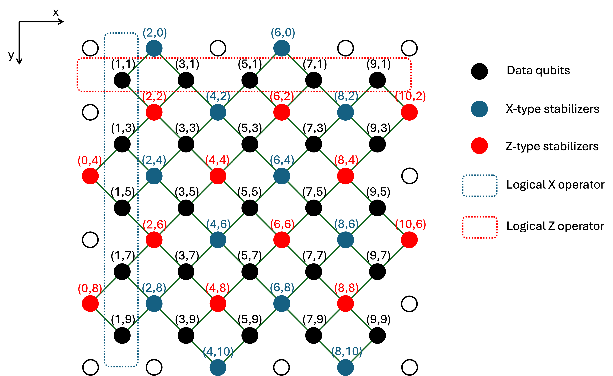
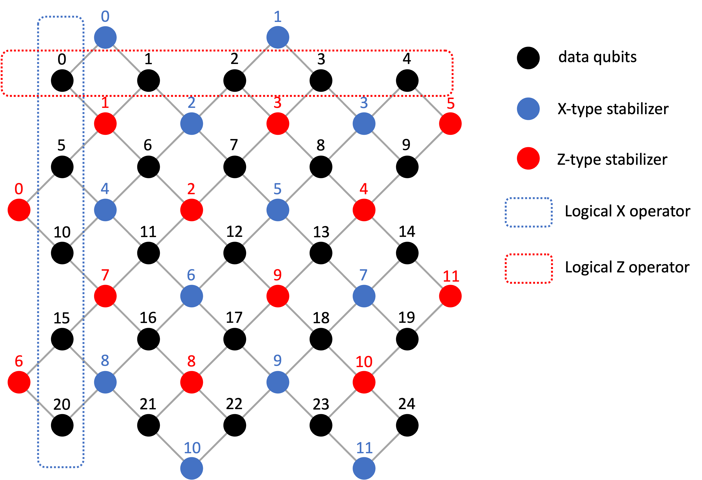

# QEC-decoder

### Dependencies and installation

- Python >= 3.8.
- [Install rust](https://www.rust-lang.org/tools/install).
- Download the repository and create a Python virtual environment:
  ```
  git clone https://github.com/caoyingkang/QEC-decoder.git
  cd QEC-decoder
  python3 -m venv .env
  source .env/bin/activate
  pip install --upgrade pip
  ```
- Install maturin: `pip install maturin`.
- Build the Rust-based Python module in the current virtual environment: `maturin develop --release`.
- (Optional) To install [PyTorch](https://pytorch.org/), which is needed in the folder `/pytorch`, build with the following command: `maturin develop --release --extras=pytorch`.


### Usage examples

- Sample syndrome-observable pairs from memory experiment for the repetition code under circuit-level noise, and decode the syndromes using BP decoder:
  ```python
  from qecdec import RepetitionCode_Memory
  from qecdec import BPDecoder

  expmt = RepetitionCode_Memory(
      d=5,
      rounds=5,
      data_qubit_error_rate=0.01,
      meas_error_rate=0.01,
      prep_error_rate=0.01,
      cnot_error_rate=0.01,
  )
  sampler = expmt.circuit.compile_detector_sampler(seed=42)
  syndromes, observables = sampler.sample(shots=10_000, separate_observables=True)

  decoder = BPDecoder(expmt.chkmat, expmt.prior, max_iter=50)
  decoded_errors = decoder.decode_batch(syndromes)
  ```

- Sample syndrome-observable pairs from Z-basis memory experiment for the rotated surface code under phenomenological noise, and decode the syndromes using a sliding window decoder, whose inner decoder is chosen to be a MWPM decoder:
  ```python
  from qecdec import RotatedSurfaceCode_Memory
  from qecdec import SlidingWindow_Decoder

  expmt = RotatedSurfaceCode_Memory(
      d=5,
      rounds=50,
      basis='Z',
      data_qubit_error_rate=0.01,
      meas_error_rate=0.01,
  )
  sampler = expmt.circuit.compile_detector_sampler(seed=42)
  syndromes, observables = sampler.sample(shots=10_000, separate_observables=True)

  decoder = SlidingWindow_Decoder.from_pcm_prior(
      expmt.chkmat,
      expmt.prior,
      detectors_per_layer=expmt.num_detectors_per_layer,
      window_size=5,
      commit_size=1
  )
  decoder.configure_inner_decoders('MWPM')
  decoded_errors = decoder.decode_batch(syndromes)
  ```

### Notations and conventions
The two figures below show the coordinates and indexing convention for the physical qubits (including data qubits and measure qubits) in a rotated surface code:



